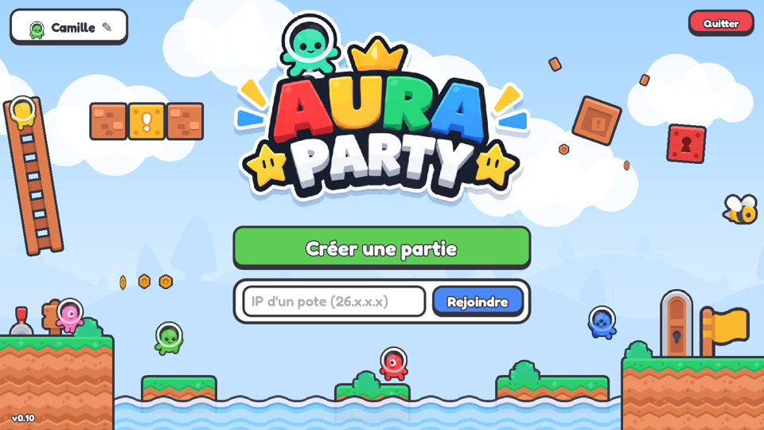

# Aura PARTY

Un party game 2D façon Mario Party, jusqu'à **8 joueurs en ligne**, chacun sur son PC Windows.
Un plateau sur une île volante, des étoiles à acheter, et 8 mini-jeux pour se trahir entre potes.

## ⬇️ Télécharger

### **[Télécharger Aura PARTY v0.12 pour Windows](https://github.com/artercamille/auraparty/raw/main/telecharger/AuraParty.zip)**

Dézippe le fichier, puis lance `AuraParty.exe`.
Si Windows affiche « Windows a protégé votre ordinateur » : *Informations complémentaires* → *Exécuter quand même*.

Tout le monde doit avoir **la même version**. Le jeu affiche un bouton sur l'écran d'accueil quand une nouvelle version sort ici.

## 🎮 Jouer ensemble

1. Celui qui héberge clique sur **Créer une partie** et donne son adresse IP aux autres.
2. Les autres collent cette IP et cliquent sur **Rejoindre**.

Pour se connecter, au choix :
- **Radmin VPN** (gratuit, le plus simple) : tout le monde rejoint le même réseau, l'IP commence par `26.`
- **Ouvrir le port** sur la box de l'hôte : **UDP 7777** vers son PC, puis donner son IP publique.

Dans le salon, l'hôte peut aussi lancer directement un mini-jeu pour le tester, sans passer par le plateau.

## ⭐ Règles

- Chacun commence avec 10 pièces. On frappe le bloc-dé (1 à 10) pour avancer.
- Case bleue **+3 pièces**, case rouge **−3 pièces**. En passant sur l'étoile avec 20 pièces, on l'achète.
- Après chaque tour de table : un mini-jeu au hasard. Les meilleurs gagnent des pièces, et le gagnant joue en premier au tour suivant.
- Le dernier mini-jeu rapporte une **étoile** au gagnant. À la fin, 3 **étoiles bonus** sont distribuées : Roi des mini-jeux, Pluie de pièces, Pas de chance.
- Le plus d'étoiles gagne, puis le plus de pièces.

## 🕹️ Les mini-jeux

| Mini-jeu | Principe |
|---|---|
| Gare aux blocs ! | Des blocs s'écrasent du ciel : regarde leur ombre. Dernier debout gagne. |
| Coup de tampon ! | Saute et retombe pour peindre le sol à ta couleur. |
| La bonne clé ! | 5 portes, 3 clés devant chacune, une seule ouvre (différente pour chacun). |
| Le grand parcours ! | Course de plateformes : pics, scies, plateformes mobiles. |
| Le rocher fou ! | Fuis le rocher géant qui accélère, sur une piste de plus en plus dure. |
| Défilé de bûches ! | Saute par-dessus les bûches sur un pont suspendu, gare aux piques. |
| Quiz sous le chapiteau ! | Retiens les ballons, puis saute sur l'estrade de la bonne réponse. |
| Grand Prix Aura ! | Course de karts vue de dessus, 3 tours, objets et turbos. |

**Commandes** : bouger Q/D ou flèches · sauter Espace (double saut) · pousser Maj/X/E/clic · plein écran F11.
Kart : Z/↑/Espace pour accélérer, S/↓ pour freiner, Q/D pour tourner, Maj/X/clic pour l'objet.

## 📸 Captures

 
 

## 🛠️ Le code

Le jeu est fait avec [Godot 4.3](https://godotengine.org/). Le projet complet est dans le dossier [`jeu/`](jeu/) :
ouvre `jeu/project.godot` dans Godot 4.3 pour le modifier ou l'exporter.

## Crédits

- Graphismes et sons : [Kenney](https://kenney.nl) (licence CC0)
- Police : Fredoka (SIL Open Font License)
