
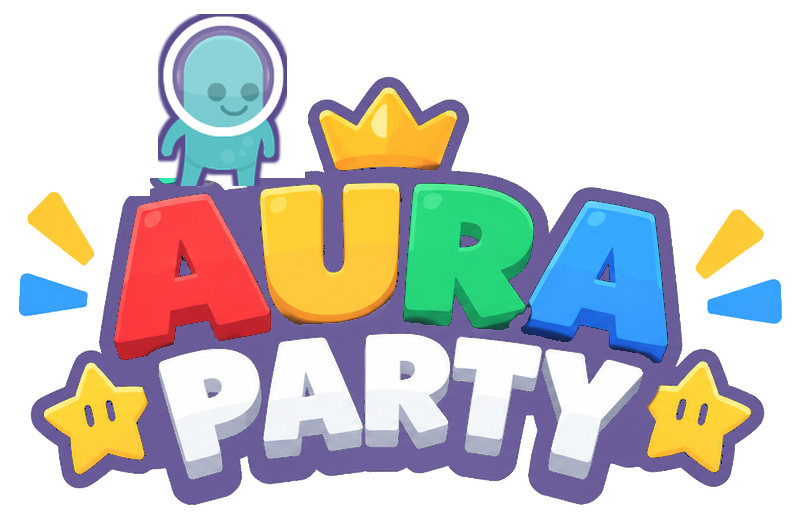

# Aura PARTY

Un party game 2D façon Mario Party, jusqu'à **8 joueurs en ligne**, chacun sur son PC Windows.
Une grande île volante avec des carrefours, des objets, une boutique, des duels, des étoiles à acheter, et 21 mini-jeux pour se trahir (ou s'entraider) entre potes.

## ⬇️ Télécharger

### **[Télécharger Aura PARTY v0.29 pour Windows](https://github.com/artercamille/auraparty/raw/main/telecharger/AuraParty.zip)**
### **[Télécharger Aura PARTY v0.29 pour Mac](https://github.com/artercamille/auraparty/raw/main/telecharger/AuraParty-Mac.zip)**

**Windows** : dézippe le fichier, puis lance `AuraParty.exe`.
Si Windows affiche « Windows a protégé votre ordinateur » : *Informations complémentaires* → *Exécuter quand même*.

**Mac** (puces Apple et Intel) : dézippe, glisse *Aura PARTY* dans Applications, puis **clic droit → Ouvrir** la première fois.
Sur macOS 15 et plus : *Réglages Système* → *Confidentialité et sécurité* → *Ouvrir quand même*. Tout est expliqué dans le LISEZ-MOI du zip.

🎮 **Jouable à la manette** (Xbox, PlayStation, Switch Pro) : les aides à l'écran affichent les boutons de la manette dès qu'on y touche.

Tout le monde doit avoir **la même version**. Le jeu affiche un bouton sur l'écran d'accueil quand une nouvelle version sort ici.

## 🎮 Jouer ensemble

1. Celui qui héberge clique sur **Créer une partie** et donne son adresse IP aux autres.
2. Les autres collent cette IP et cliquent sur **Rejoindre**.

Pour se connecter, au choix :
- **Radmin VPN** (gratuit, le plus simple, Windows seulement) : tout le monde rejoint le même réseau, l'IP commence par `26.`
- **ZeroTier** (gratuit, Windows **et Mac**) : à utiliser par toute la bande s'il y a un pote sur Mac.
- **Ouvrir le port** sur la box de l'hôte : **UDP 7777** vers son PC, puis donner son IP publique.

Dans le salon, l'hôte peut aussi lancer directement un mini-jeu pour le tester, sans passer par le plateau.

## ⭐ Règles

- Chacun commence avec 10 pièces au **village**. À ton tour : lancer le dé (1 à 10), utiliser un objet, ou regarder la carte (**Tab**).
- L'île a 6 zones (village, forêt, lac, château, volcan, plage) et des **carrefours** : à toi de choisir ta route (le pont du château coûte 5 pièces).
- En passant sur l'**étoile** avec 20 pièces, on l'achète. Elle s'envole ensuite ailleurs.
- Les cases : bleue **+3**, rouge **−3**, **?** événement de la zone, **!** carte chance, cadeau (objet gratuit), **VS** duel 1 contre 1, piège (−10 pièces dans la banque), banque, boutique (4 sur l'île), tuyau (téléportation), **Roi Grognon** (malus), **fantôme** (vole des pièces ou une étoile). Des blocs cachés et des rochers-péages en plus.
- 8 objets (3 max dans le sac) : champignon, double dé, triple dé, dé pipé, champi poison, cloche fantôme, échangeur, tuyau doré.
- Après chaque tour de table : un mini-jeu au hasard (pas de répétition tant que tous les autres ne sont pas passés). Les meilleurs gagnent des pièces, et le gagnant joue en premier au tour suivant.
- Au début, chacun tape un bloc pour savoir qui commence. À 5 tours de la fin, le dernier reçoit un coup de pouce et les cases bleues/rouges comptent double.
- Le dernier mini-jeu rapporte une **étoile** au gagnant. À la fin, 3 **étoiles bonus** sont distribuées : Roi des mini-jeux, Pluie de pièces, Pas de chance.
- Le plus d'étoiles gagne, puis le plus de pièces.

## 🕹️ Les mini-jeux

| Mini-jeu | Principe |
|---|---|
| Gare aux blocs ! | Des blocs s'écrasent du ciel : regarde leur ombre. Dernier debout gagne. |
| Coup de tampon ! | Saute et retombe pour peindre le sol à ta couleur. |
| La bonne clé ! | 5 portes, 3 clés devant chacune, une seule ouvre (différente pour chacun). |
| Le grand parcours ! | Course de plateformes : pics, scies, plateformes mobiles. |
| Le rocher fou ! | Fuis le rocher géant qui accélère, sur une piste de plus en plus dure. |
| Défilé de bûches ! | Saute par-dessus les bûches sur un pont suspendu, gare aux piques. |
| Quiz sous le chapiteau ! | Retiens les ballons, puis saute sur l'estrade de la bonne réponse. |
| Grand Prix Aura ! | Course de karts vue de dessus, 3 tours, objets et turbos. |
| Mini-triathlon ! | Pagaie, vélo puis haies, chacun dans son couloir : alterne les touches le plus vite possible. |
| Fusées en folie ! | Course de fusées jusqu'à la Lune en slalomant entre astéroïdes et soucoupes. |
| Champi-couleurs ! | (Mushroom Mix-Up) Saute sur le champignon de la couleur annoncée avant que les autres coulent. |
| Bombe chaude ! | (Hot Bob-omb) On se passe la bombe en cercle : celui qui l'a quand elle explose est éliminé. |
| Tir à la corde ! | (Tug o' War) En équipes jusqu'à 4 contre 4 : martèle Espace pour tirer l'autre équipe dans la boue. |
| Boules-tamponneuses ! | (Bumper Balls) Sur une boule dans une arène ronde : éjecte les autres. |
| Stop chrono ! | Un temps à viser, un chrono qui se cache : arrête-le pile au bon moment. 3 manches, le plus petit total d'écarts gagne. |
| Jackpot Aura ! | (Lucky Lineup) Chacun sa machine à sous : arrête les rouleaux pile au bon moment pour aligner les 7. |
| Mémo-boum ! | (Memory Mash) En équipes : frappe le sol sur les cartes pour les retourner, la première équipe à 4 paires gagne. |
| Le Capitaine a dit ! | (Shy Guy Says) Lève le même drapeau que le capitaine, sinon il coupe ta corde. Gare aux feintes ! |
| Roulette-marteau ! | (Spin and Bear It) Choisis ta place sur la roue : celui qui s'arrête devant le marteau est écrasé. |
| Pingouins perdus ! | **COOP** (Penguin Pushers) Rabattez ensemble les bébés pingouins vers leur parent avant la fin du temps. |
| Cuisine en folie ! | **COOP** Façon Overcooked : coupez, cuisez, servez burgers et salades en équipe. |

**Manette** : croix/stick pour choisir et bouger · A pour valider/sauter · B retour · X/B pousser · Y carte · LB/RB émotes.

**Clavier** : plateau : Espace pour valider, ← → pour choisir, Tab pour la carte, 1 à 6 pour les émotes · M pour couper la musique · mini-jeux : bouger Q/D ou flèches · sauter Espace (double saut) · pousser Maj/X/E/clic · plein écran F11.
Kart : Z/↑/Espace pour accélérer, S/↓ pour freiner, Q/D pour tourner, Maj/X/clic pour l'objet.
Triathlon : Q/D en alternance (pagaie), Z/S en alternance (vélo), Espace (haies). Fusées : Q/D pour slalomer, Z pour accélérer, S pour freiner.

## 📸 Captures

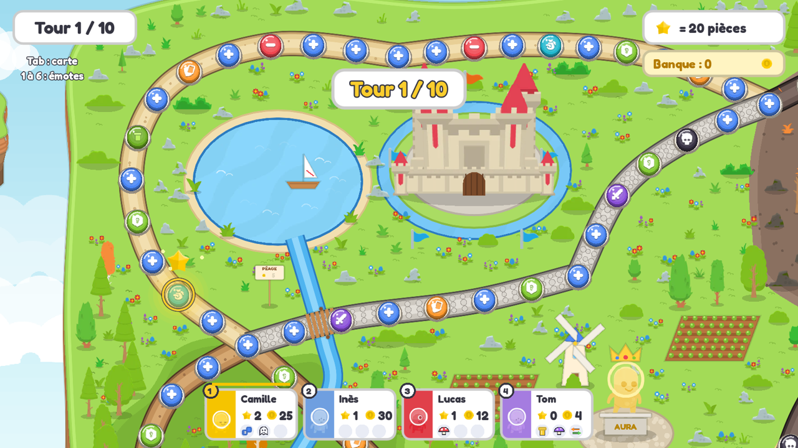 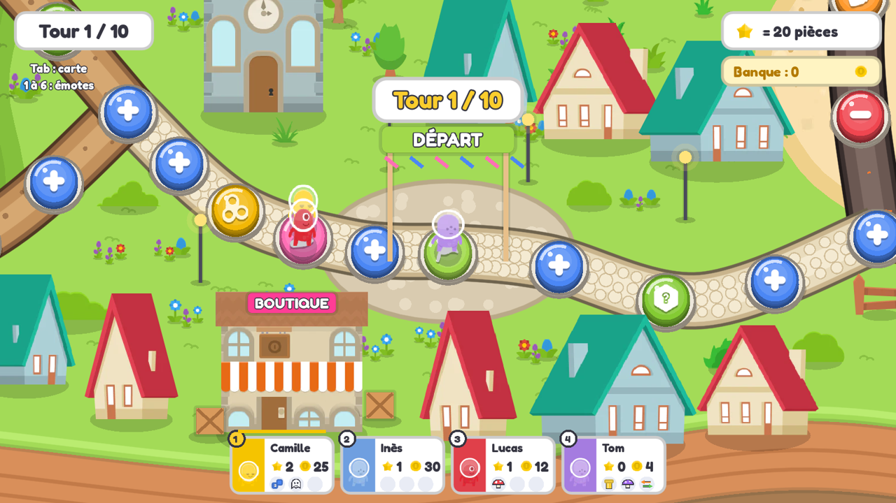
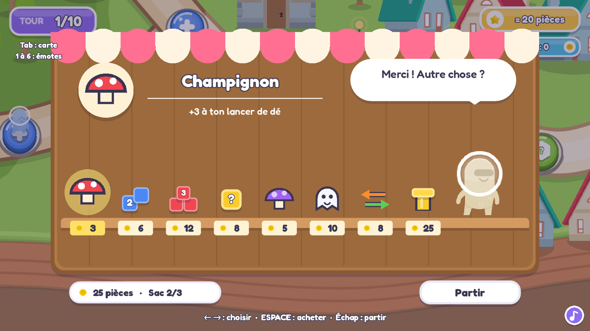 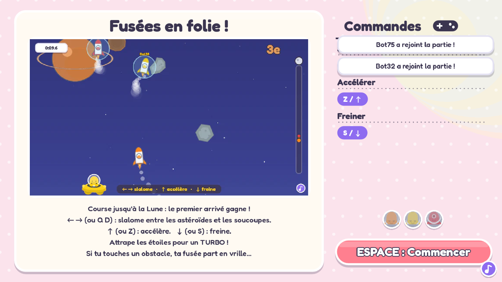
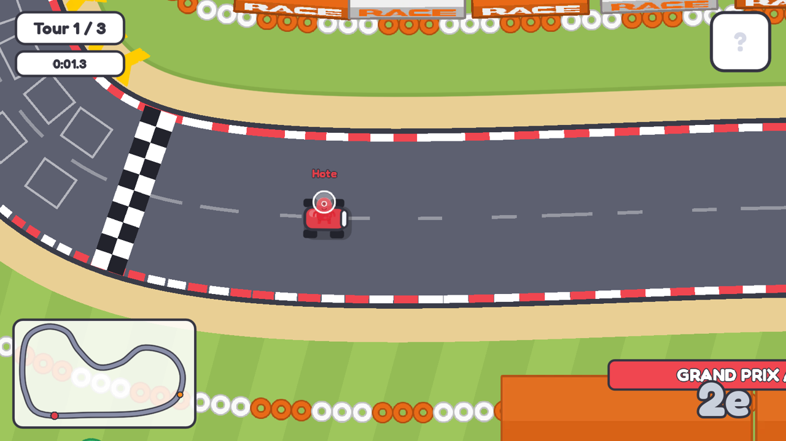 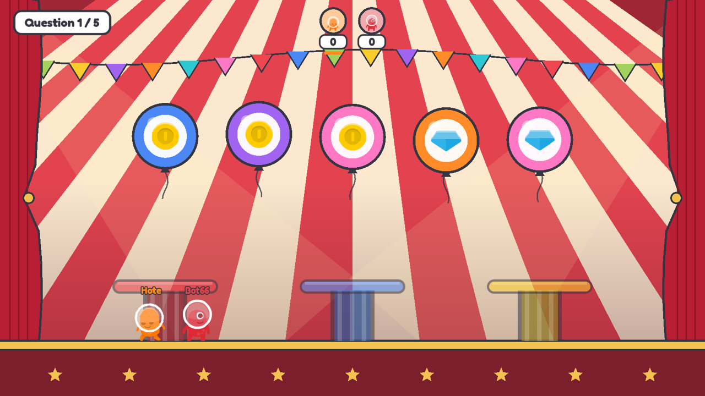
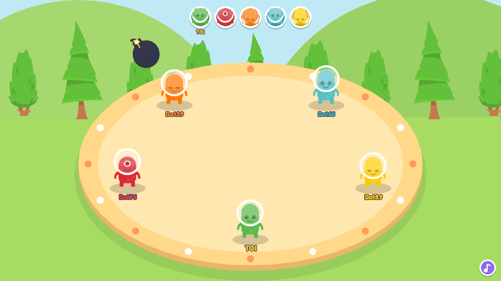 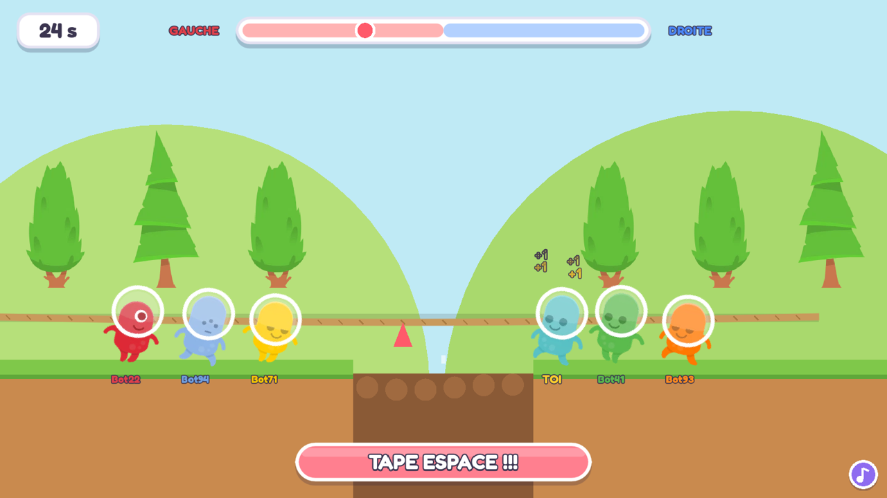
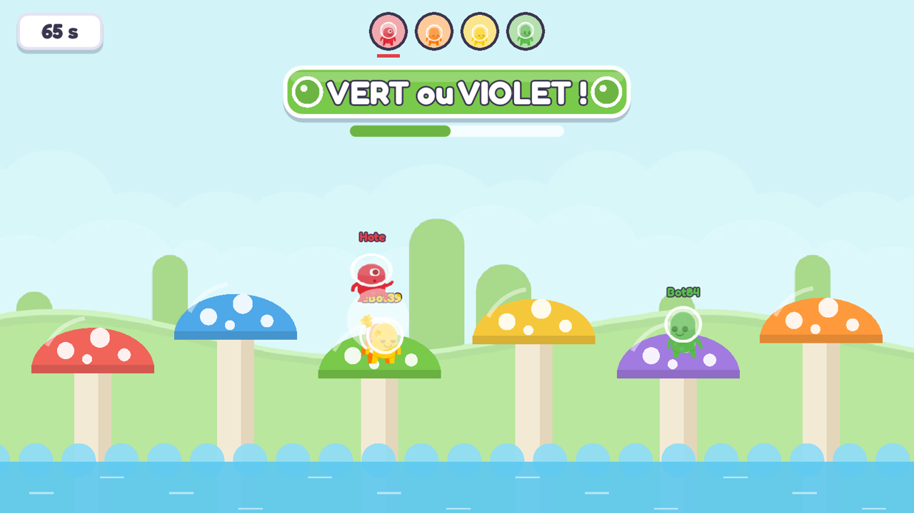 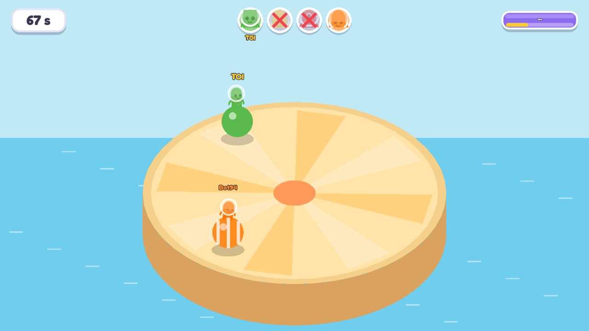
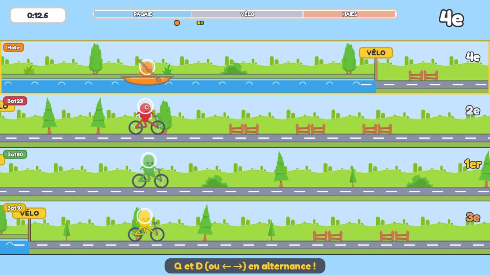 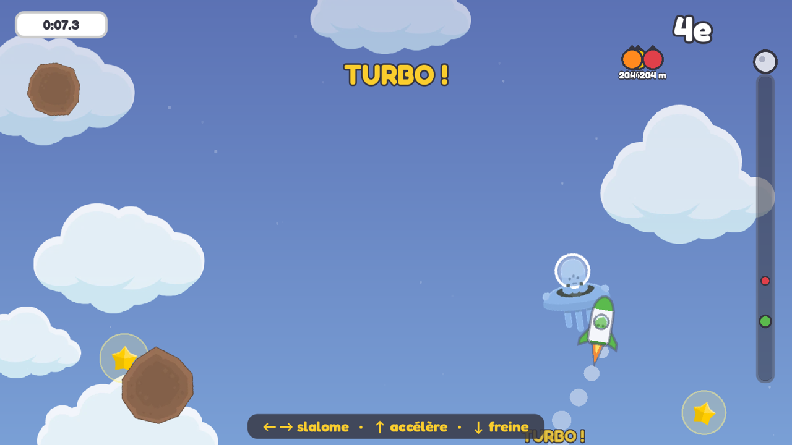
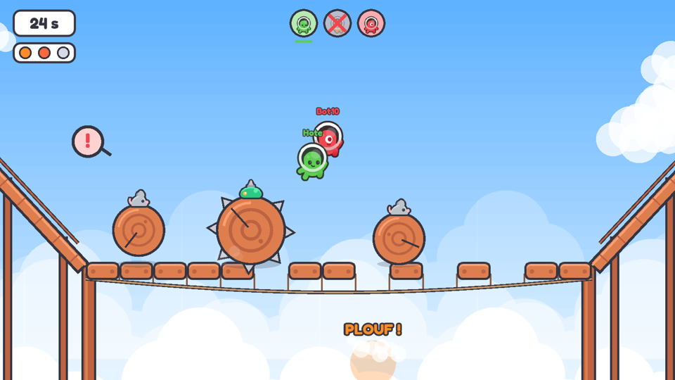 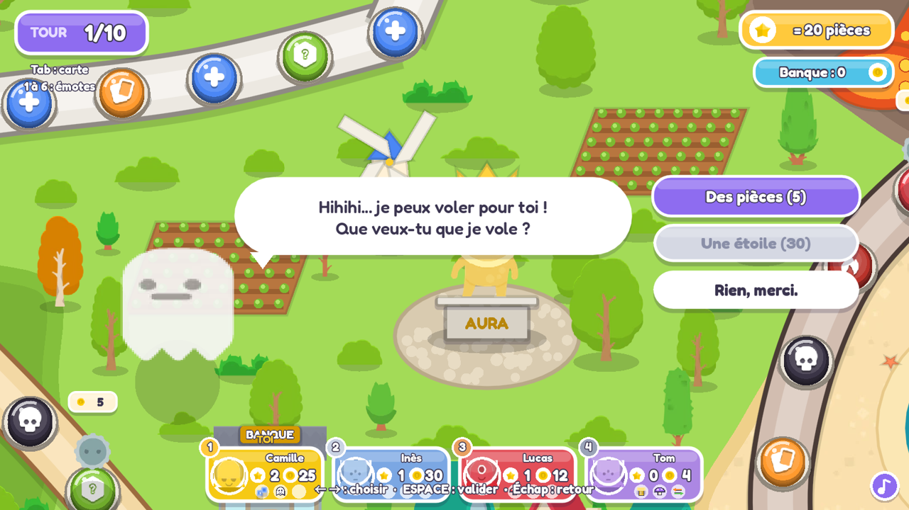

## 🛠️ Le code

Le jeu est fait avec [Godot 4.3](https://godotengine.org/). Le projet complet est dans le dossier [`jeu/`](jeu/) :
ouvre `jeu/project.godot` dans Godot 4.3 pour le modifier ou l'exporter.

## Crédits

- Graphismes et sons : [Kenney](https://kenney.nl) (licence CC0)
- Musiques : [FreePD](https://freepd.com) (domaine public)
- Police : Fredoka (SIL Open Font License)
