

# 🎲 Les mini-jeux d'Aura PARTY

*Version 0.30 · 23 mini-jeux*

Ce document décrit tous les mini-jeux du jeu : le but, les règles, les commandes au clavier et à la manette, et comment on gagne.
Pour les règles du plateau, voir le [README](../README.md).

**Sommaire** : [Comment ça marche](#-comment-ça-marche) · [Vue d'ensemble](#-vue-densemble) · [Survie](#-survie--le-dernier-debout-gagne) · [Courses](#-courses--le-premier-arrivé-gagne) · [Scores](#-scores--le-meilleur-score-gagne) · [En équipes](#-en-équipes) · [Coop](#-coop--tous-ensemble-contre-le-jeu) · [Pour les développeurs](#️-pour-les-développeurs)

---

## 🎯 Comment ça marche

**Quand joue-t-on un mini-jeu ?**
- **Après chaque tour de table** : un mini-jeu pour tout le monde, tiré au hasard.
- **Case VS (duel)** : un mini-jeu à 2 ; le gagnant prend la mise à l'autre. Les autres regardent.
- **Depuis le salon** : l'hôte clique sur *Tester un mini-jeu (sans plateau)* pour en lancer un directement, puis tout le monde revient au salon.

**La pioche** : un mini-jeu ne revient pas tant que tous les autres ne sont pas passés. Dans les *Options* du salon, l'hôte peut retirer les mini-jeux qu'il n'aime pas.

**Avant de jouer** : un écran présente le jeu (aperçu, règles, encart *Commandes*). Chacun appuie sur **Espace** (ou **A** à la manette) quand il est prêt. Ça démarre quand tout le monde est prêt, ou au bout de 20 secondes. Puis compte à rebours 3, 2, 1... GO !

**Les gains**

| Place | 1er | 2e | 3e | 4e | 5e | 6e | 7e | 8e |
|---|---|---|---|---|---|---|---|---|
| Pièces | +8 | +5 | +3 | +2 | +1 | +1 | 0 | 0 |

- Égalité = même place, mêmes pièces.
- Le gagnant du mini-jeu joue **en premier** au tour suivant.
- **Dernier mini-jeu de la partie** : le gagnant remporte aussi une **étoile** ⭐.
- **Duel** : le gagnant prend la mise au perdant (rien ne bouge en cas d'égalité).
- **Jeux coop** : tout le monde gagne les mêmes pièces selon le rang de l'équipe (S = 10, A = 7, B = 4, raté = 0).

**Éliminé ou déjà arrivé ?** On regarde les autres jouer : **← →** pour changer de joueur.

**Manette** : les aides à l'écran passent toutes seules en boutons de manette dès qu'on y touche.
En général : **Espace = A**, **Maj / X / clic = X** (ou B), **Q D / flèches = croix ou stick**.

---

## 📋 Vue d'ensemble

| Mini-jeu | Genre | Durée | En duel ? | Inspiré de |
|---|---|---|---|---|
| [Gare aux blocs !](#gare-aux-blocs-) | Survie | 60 s | ✅ | — |
| [Le rocher fou !](#le-rocher-fou-) | Survie | 50 s | ✅ | — |
| [Défilé de bûches !](#défilé-de-bûches-) | Survie | 60 s | ✅ | — |
| [Champi-couleurs !](#champi-couleurs-) | Survie | 75 s max | ✅ | Mushroom Mix-Up (Mario Party) |
| [Boules-tamponneuses !](#boules-tamponneuses-) | Survie | 75 s max | ✅ | Bumper Balls (Mario Party) |
| [Bombe chaude !](#bombe-chaude-) | Survie | ~1 min 30 | ✅ | Hot Bob-omb (Mario Party) |
| [Le Capitaine a dit !](#le-capitaine-a-dit-) | Survie | ~1 min 15 | ✅ | Shy Guy Says (Mario Party Superstars) |
| [Roulette-marteau !](#roulette-marteau-) | Survie | quelques manches | ✅ | Spin and Bear It (Mario Party) |
| [La bonne clé !](#la-bonne-clé-) | Course | 60 s max | ✅ | — |
| [Le grand parcours !](#le-grand-parcours-) | Course | 75 s max | ✅ | — |
| [Grand Prix Aura !](#grand-prix-aura-) | Course | 3 tours | ❌ (trop long) | Mario Kart |
| [Mini-triathlon !](#mini-triathlon-) | Course | ~1 min 30 | ✅ | — |
| [Fusées en folie !](#fusées-en-folie-) | Course | 90 s max | ✅ | — |
| [Sors du labyrinthe !](#sors-du-labyrinthe-) 🆕 | Course | 90 s max | ✅ | idée de Camille |
| [Coup de tampon !](#coup-de-tampon-) | Score | 50 s | ✅ | — |
| [Quiz sous le chapiteau !](#quiz-sous-le-chapiteau-) | Score | 5 questions | ✅ | — |
| [Jackpot Aura !](#jackpot-aura-) | Score | 3 tirages | ✅ | Lucky Lineup (Mario Party) |
| [Stop chrono !](#stop-chrono-) | Score | 3 manches | ✅ | idée de Camille |
| [Toujours plus haut !](#toujours-plus-haut-) 🆕 | Score | 60 s | ✅ | Doodle Jump |
| [Tir à la corde !](#tir-à-la-corde-) | Équipes | 30 s max | ✅ (1 contre 1) | Tug o' War (Mario Party) |
| [Mémo-boum !](#mémo-boum-) | Équipes | 3 min max | ✅ (1 contre 1) | Memory Mash (Mario Party DS) |
| [Pingouins perdus !](#pingouins-perdus-) | Coop | 60 s | ❌ | Penguin Pushers (Mario Party) |
| [Cuisine en folie !](#cuisine-en-folie-) | Coop | 100 s | ❌ | Overcooked |

---

## 💥 Survie : le dernier debout gagne

Dans ces jeux, on est éliminé en tombant, en se faisant écraser ou toucher. Le dernier encore en jeu gagne ; les autres sont classés selon le temps qu'ils ont tenu. Si plusieurs tiennent jusqu'à la fin du temps, ils gagnent tous.

### Gare aux blocs !
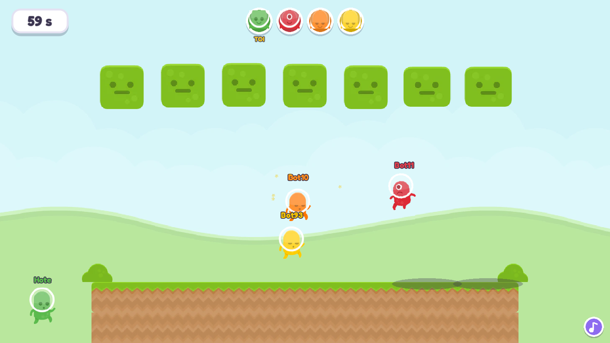

**But** : esquiver les blocs grincheux qui s'écrasent du ciel.
- Regarde leur **ombre** au sol pour savoir où ils vont tomber.
- Pousse les autres dessous !
- Le motif de chute est le même pour tout le monde.

**Commandes** : bouger **Q D / ← →** · sauter **Espace** (double saut) · pousser **Maj / X / clic**.
🎮 Manette : croix ou stick · **A** sauter · **X** pousser.

### Le rocher fou !
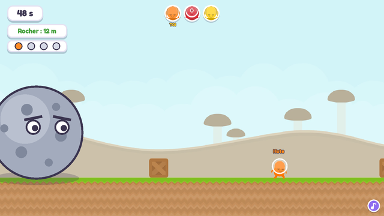

**But** : fuir un rocher géant qui te fonce dessus.
- Le début est tranquille, puis la piste devient de plus en plus dure (caisses, trous, pics, ponts, pierres de gué, scies) et le rocher accélère.
- Pousse les autres vers le rocher.

**Commandes** : bouger **Q D / ← →** · sauter **Espace** (double saut) · pousser **Maj / X / clic**.
🎮 Manette : croix ou stick · **A** sauter · **X** pousser.

### Défilé de bûches !
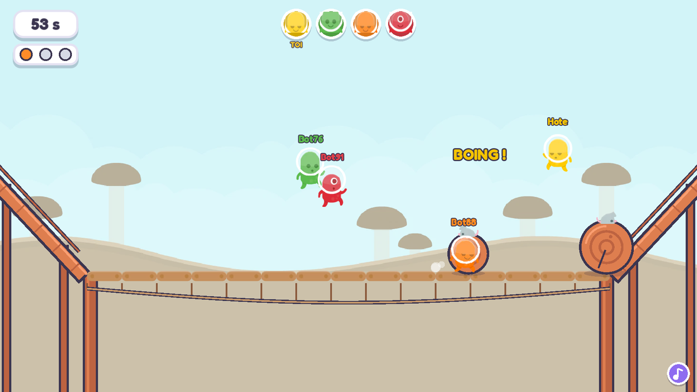

**But** : rester sur le pont suspendu pendant que les bûches dévalent.
- Saute par-dessus les bûches, ou rebondis sur la souris qui court dessus.
- Une bûche te touche : tu valses. Attention aux bords !
- Les bûches **à piques** cassent les planches qui rougissent.

**Commandes** : bouger **Q D / ← →** · sauter **Espace** (double saut) · pousser **Maj / X / clic**.
🎮 Manette : croix ou stick · **A** sauter · **X** pousser.

### Champi-couleurs !
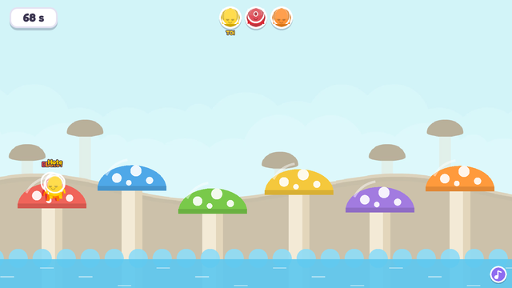

**But** : être sur le bon champignon quand les autres coulent.
- Une couleur s'affiche en haut de l'écran : saute vite sur le champignon de cette couleur.
- Tous les autres champignons coulent ! On peut pousser les autres à l'eau.
- Ça va de plus en plus vite.

**Commandes** : bouger **Q D / ← →** · sauter **Espace** (double saut) · pousser **Maj / X / clic**.
🎮 Manette : croix ou stick · **A** sauter · **X** pousser.

### Boules-tamponneuses !
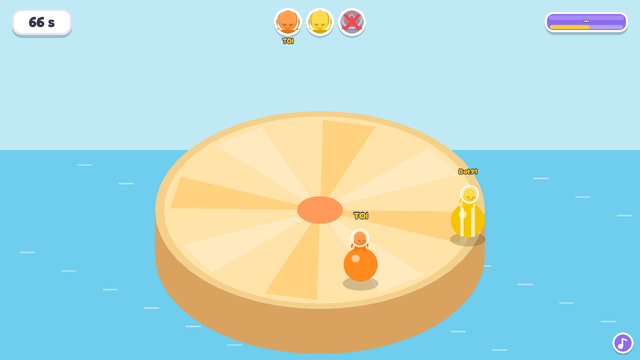

**But** : éjecter les autres de l'arène.
- Chacun roule sur une grosse boule au milieu de l'eau.
- Fonce dans les autres pour les faire tomber.
- À la fin, l'arène **rétrécit**...

**Commandes** : bouger **flèches** ou **Z Q S D** · boost **Maj / X / clic**.
🎮 Manette : stick · **X** boost.

### Bombe chaude !
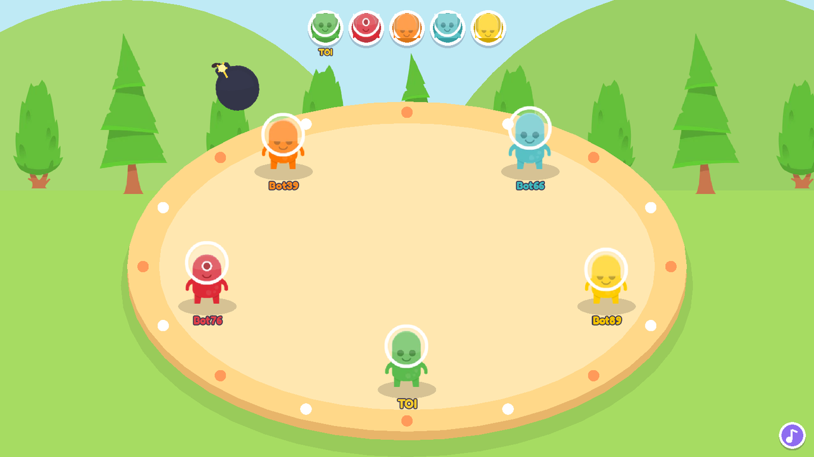

**But** : ne pas avoir la bombe quand elle explose.
- Tout le monde est assis en cercle et la bombe circule.
- Si tu l'as, lance-la vite à ton voisin de gauche ou de droite.
- Celui qui la tient quand elle explose est éliminé ; on recommence avec les autres.

**Commandes** : lancer à gauche **Q / ←** · lancer à droite **D / → / Espace**.
🎮 Manette : croix gauche / droite.

### Le Capitaine a dit !
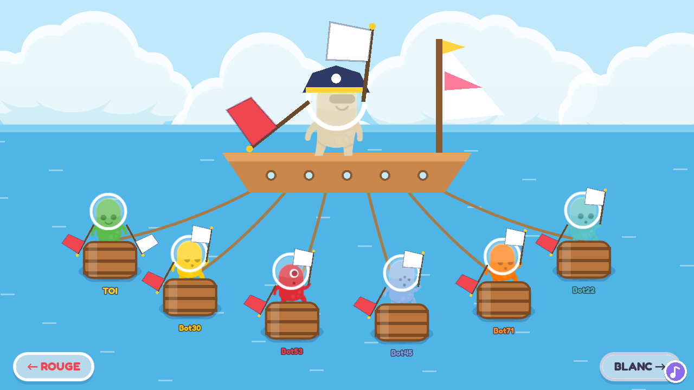

**But** : lever le même drapeau que le capitaine.
- Le capitaine lève le drapeau **rouge** ou le drapeau **blanc** : lève vite le même.
- Mauvais drapeau ou trop lent = ta corde est coupée.
- Attention aux **feintes** : deux drapeaux levés, ou un drapeau qu'il change au dernier moment.
- Il va de plus en plus vite. Un minuteur de 30 s apparaît : s'il reste du monde à la fin, tous les survivants gagnent.

**Commandes** : drapeau rouge **Q / ←** · drapeau blanc **D / →**.
🎮 Manette : croix gauche / droite.

### Roulette-marteau !
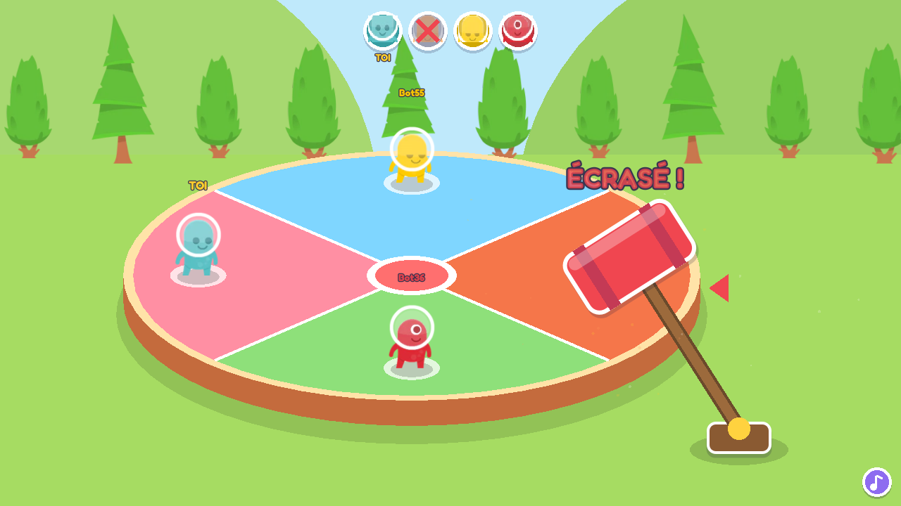

**But** : ne pas s'arrêter devant le marteau.
- Chacun choisit sa place sur la grande roue (une place par joueur).
- Une flèche désigne celui qui fait tourner la roue : il maintient Espace puis lâche.
- Quand la roue s'arrête, celui qui est devant le marteau est écrasé !
- À chaque manche, une place de moins. Le dernier épargné gagne.

**Commandes** : choisir sa place **Q D / ← →** · valider **Espace** · lancer la roue : **maintenir Espace puis lâcher**.
🎮 Manette : croix · **A**.

---

## 🏁 Courses : le premier arrivé gagne

Le premier arrivé gagne, puis les suivants dans l'ordre d'arrivée. Ceux qui ne sont pas arrivés à la fin sont classés selon leur avancée.

### La bonne clé !
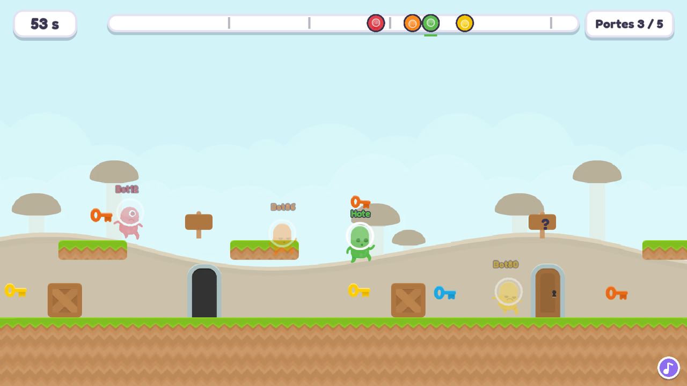

**But** : franchir les 5 portes en premier.
- Devant chaque porte, 3 clés : une seule l'ouvre (et ce n'est pas la même pour chacun !).
- Ramasse une clé (passe dessus) et fonce vers la porte. Mauvaise clé ? Tu te fais repousser : reviens en chercher une autre.
- Les autres joueurs sont des fantômes : on ne se gêne pas.

**Commandes** : bouger **Q D / ← →** · sauter **Espace** (double saut) · ramasser une clé : **passer dessus**.
🎮 Manette : croix ou stick · **A** sauter.

### Le grand parcours !
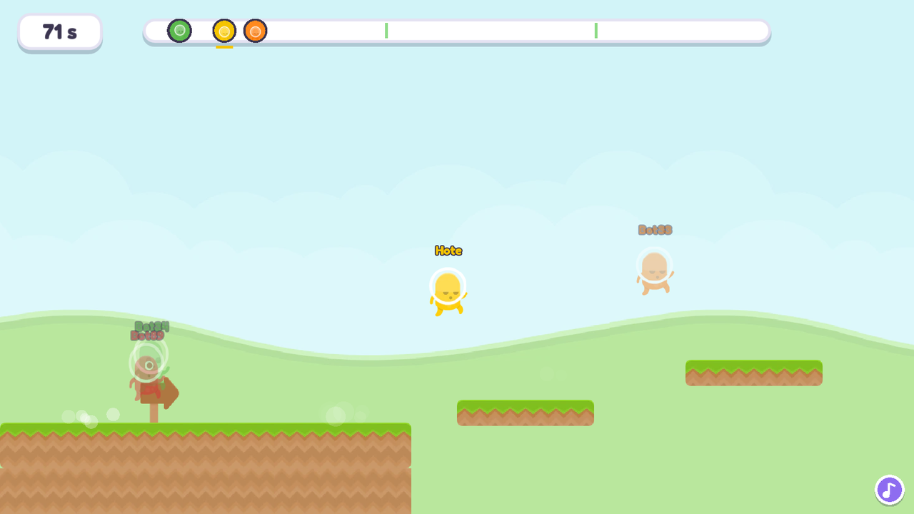

**But** : atteindre l'arrivée d'un parcours de plateformes.
- Évite les pics et les scies, attention aux plateformes mobiles.
- Les **drapeaux** sauvegardent ta progression.
- Les autres joueurs sont des fantômes.

**Commandes** : bouger **Q D / ← →** · sauter **Espace** (double saut, garder appuyé pour sauter plus haut).
🎮 Manette : croix ou stick · **A** sauter.

### Grand Prix Aura !
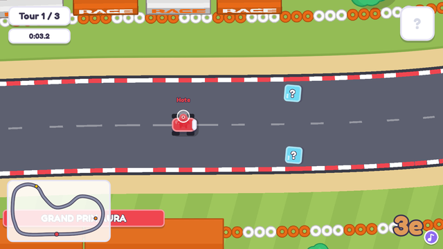

**But** : finir les 3 tours de circuit en premier (karts vus de dessus).
- Roule sur les cubes **?** pour avoir un objet : **banane** (posée derrière), **carapace** (lancée devant), **champignon** (turbo).
- Tourne longtemps à fond : des étincelles chargent un **turbo** !
- Les flèches jaunes au sol te propulsent.
- Jamais en duel (trop long).

**Commandes** : accélérer **Z / ↑ / Espace** · freiner **S / ↓** · tourner **Q D** · objet **Maj / X / clic**.
🎮 Manette : stick pour tourner · **A** accélérer · **X** objet.

### Mini-triathlon !
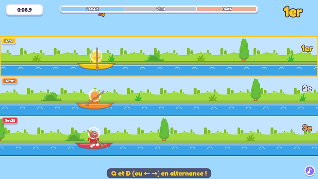

**But** : enchaîner trois épreuves dans son couloir et arriver le premier.
1. **Pagaie** : appuie sur Q et D (ou ← →) **en alternance**.
2. **Vélo** : appuie sur Z et S (ou ↑ ↓) **en alternance**.
3. **Haies** : tu cours tout seul, Espace pour sauter.

Deux fois la même touche de suite = tu ralentis !

**Commandes** : pagaie **Q D** en alternance · vélo **Z S** en alternance · haies **Espace**.
🎮 Manette : croix gauche/droite puis haut/bas en alternance · **A** pour les haies.

### Fusées en folie !
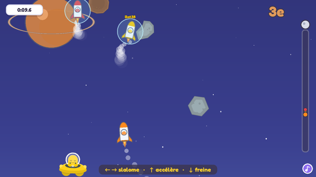

**But** : arriver le premier sur la Lune.
- Slalome entre les astéroïdes et les soucoupes.
- Attrape les **étoiles** pour un turbo.
- Touche un obstacle et ta fusée part en vrille.
- Après le premier arrivé, les autres ont 15 secondes.

**Commandes** : slalomer **Q D / ← →** · accélérer **Z / ↑** · freiner **S / ↓**.
🎮 Manette : croix ou stick.

### Sors du labyrinthe !
🆕 *Nouveau en v0.30.*

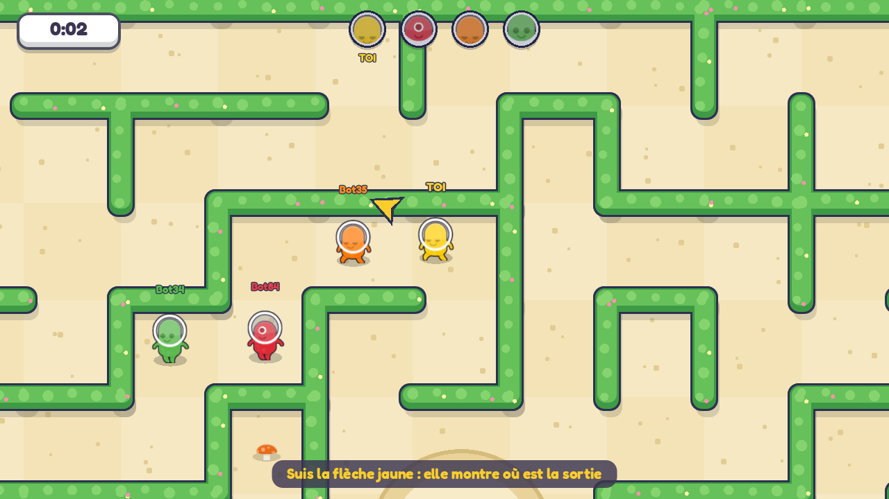

**But** : sortir le premier d'un grand labyrinthe de haies.
- Tout le monde part du **centre** (case *DÉPART*). Il n'y a **qu'une seule sortie**, sur un bord.
- On ne voit qu'un bout du labyrinthe autour de soi.
- La **flèche jaune** autour de ton perso montre la **direction** de la sortie... pas le chemin ! Il faudra faire des détours.
- Les **champignons** au fond des culs-de-sac font courir plus vite pendant 3 s : un cul-de-sac n'est jamais complètement perdu.
- On passe à travers les autres joueurs (personne ne bloque un couloir). Suivre quelqu'un peut aider... ou pas !
- Après le premier sorti, les autres ont **15 secondes** pour sortir à leur tour. Ceux qui restent dedans sont classés selon le nombre de cases qui leur restait jusqu'à la sortie.
- Le labyrinthe change à chaque partie (mais il est le même pour tout le monde).

**Commandes** : bouger **flèches** ou **Z Q S D**.
🎮 Manette : croix ou stick.

---

## 🏆 Scores : le meilleur score gagne

### Coup de tampon !
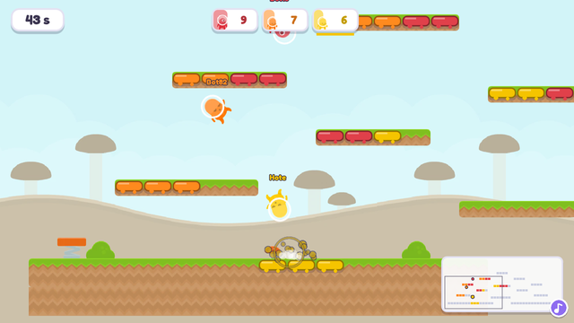

**But** : peindre le plus de sol à sa couleur.
- Saute et retombe sur le sol pour le peindre.
- Appuie sur **↓ en l'air** pour un piqué : ton tampon est plus large.
- Tomber dans le vide = tu réapparais. Une mini-carte montre le territoire de chacun.

**Commandes** : bouger **Q D / ← →** · sauter **Espace** (double saut) · piqué **↓** · pousser **Maj / X**.
🎮 Manette : croix ou stick · **A** sauter · **X** pousser.

### Quiz sous le chapiteau !
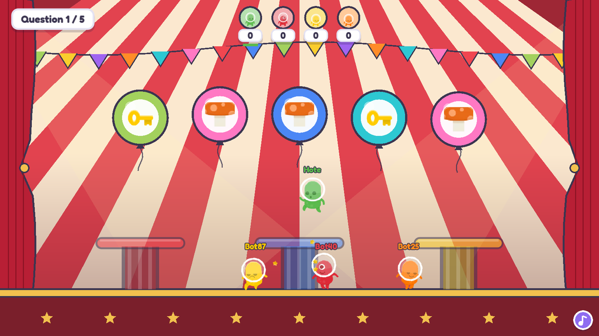

**But** : répondre juste et vite à 5 questions.
- Regarde bien les ballons : ils ne montrent leurs images qu'un instant (à compter, à retenir, bonneteau...).
- Une question arrive avec 3 réponses sur les estrades : saute sur la bonne.
- La **première estrade où tu te poses** est ta réponse !
- Les plus rapides gagnent plus de points (5, 3, 2, 1).

**Commandes** : bouger **Q D / ← →** · sauter **Espace** (double saut) · pousser **Maj / X / clic**.
🎮 Manette : croix ou stick · **A** sauter.

### Jackpot Aura !
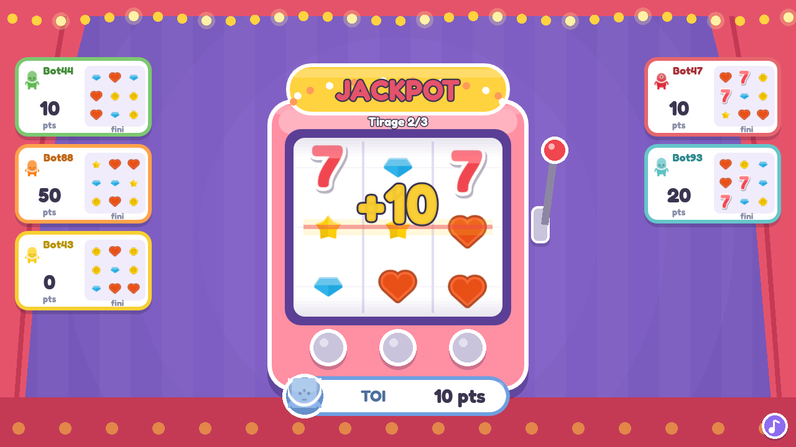

**But** : faire le plus de points avec sa machine à sous (chacun la sienne).
- 3 tirages. Appuie sur Espace pour arrêter les rouleaux un par un.
- 3 symboles pareils sur une ligne ou une diagonale = des points : **7 = 50** · gemme = 20 · cœur = 10 · pièce = 5.
- L'**étoile** est un joker.

**Commandes** : arrêter un rouleau **Espace / Entrée**.
🎮 Manette : **A**.

### Stop chrono !
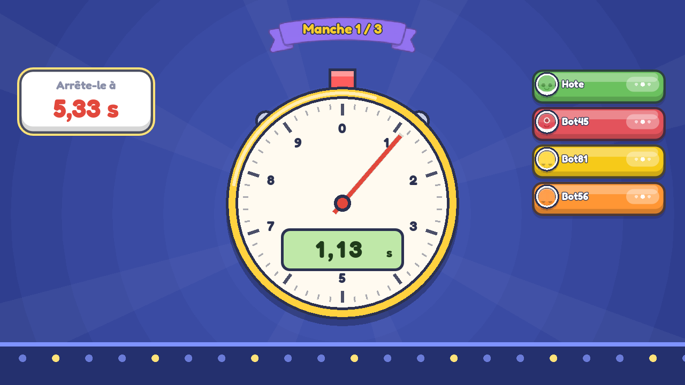

**But** : arrêter le chrono pile au temps demandé.
- Un temps à viser s'affiche (par exemple 7,38 s), puis le chrono démarre.
- Il reste visible un moment, puis un volet le **cache** : compte dans ta tête !
- 3 manches ; le chrono se cache de plus en plus tôt (après 3 s, 2 s puis 1,2 s).
- On additionne tes écarts : le plus petit total gagne. Après chaque manche, tout le monde voit les temps de chacun.

**Commandes** : arrêter le chrono **Espace**.
🎮 Manette : **A**.

### Toujours plus haut !
🆕 *Nouveau en v0.30, façon Doodle Jump.*

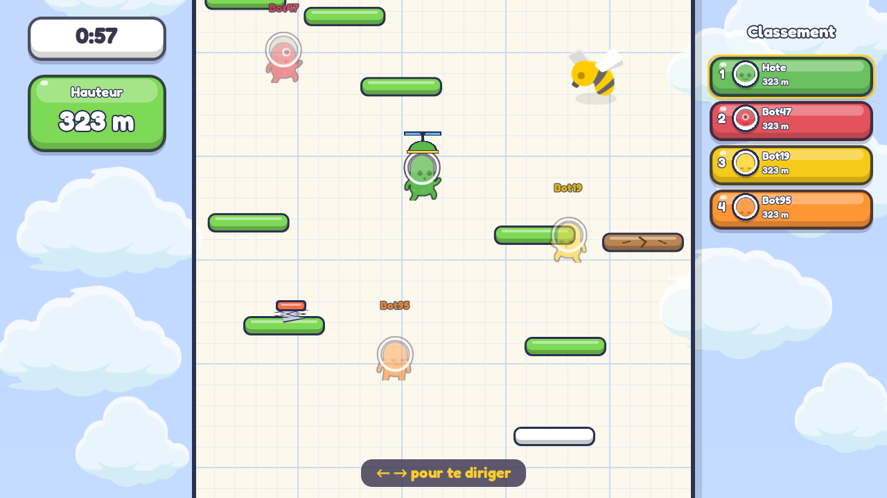

**But** : monter le plus haut possible en 1 minute, sans tomber.
- On **rebondit tout seul** dès qu'on retombe sur une plateforme : il suffit de se diriger.
- L'écran **boucle** : sors à gauche, tu reviens à droite (et inversement).
- L'écran ne redescend jamais : si tu tombes en bas, **c'est fini** (ta hauteur est gardée).
- Les plateformes :
  - 🟩 **vertes** : normales ;
  - 🟦 **bleues** : elles bougent de gauche à droite ;
  - 🟫 **marron** : elles **cassent** quand on atterrit dessus (pas de rebond !) ;
  - ⬜ **blanches** : elles disparaissent après un saut.
- Les bonus :
  - **ressort** : super saut (avec un salto) ;
  - **casquette à hélice** : on s'envole tout droit pendant quelques secondes.
- Les **monstres** (abeilles, mouches, slimes) : saute-leur **dessus** pour les écraser (et rebondir). Les toucher autrement = tu tombes !
- Tout le monde a les mêmes plateformes ; les autres joueurs sont dessinés en transparence. Ça devient plus dur en montant.
- Au bout d'une minute, le plus haut gagne. À droite, le classement en direct ; à gauche, ta hauteur en mètres.

**Commandes** : aller à gauche / droite **Q D / ← →**.
🎮 Manette : croix ou stick.

---

## 🤝 En équipes

Avec un nombre impair de joueurs, un joueur tiré au sort devient **arbitre** et gagne d'office.

### Tir à la corde !
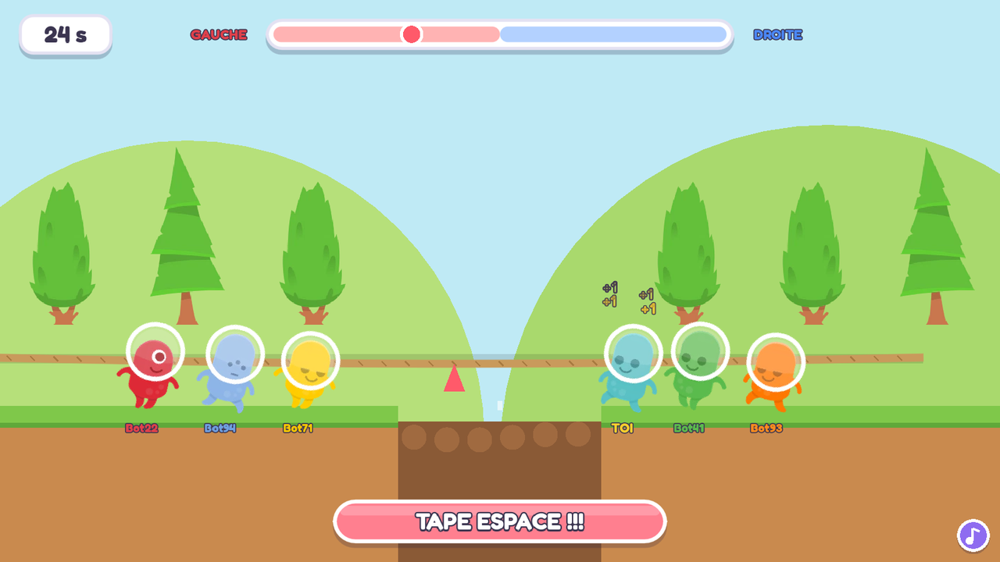

**But** : tirer l'autre équipe dans la boue.
- Deux équipes (jusqu'à 4 contre 4) tirent sur une corde au-dessus de la boue.
- Martèle Espace le plus vite possible pour tirer.
- L'équipe qui se fait tirer dans la boue a perdu.

**Commandes** : tirer : **marteler Espace** (ou n'importe quelle touche).
🎮 Manette : marteler **A**.

### Mémo-boum !
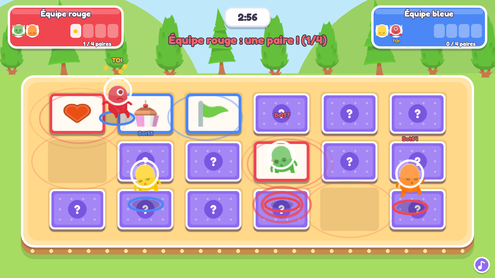

**But** : être la première équipe à trouver 4 paires.
- 18 cartes face cachée sont posées au sol (vue de dessus).
- Saute, puis frappe le sol (Espace en l'air) sur une carte pour la retourner.
- 2 cartes pareilles retournées par ton équipe = une paire.
- Retiens les cartes retournées par les autres... et assomme-les en frappant le sol près d'eux !

**Commandes** : bouger **flèches** ou **Z Q S D** · sauter **Espace** · frapper le sol : **Espace en l'air**.
🎮 Manette : stick · **A** sauter puis **A** en l'air.

---

## 🧡 Coop : tous ensemble contre le jeu

Tout le monde gagne **les mêmes pièces** selon le rang de l'équipe. Ces jeux ne tombent **jamais en duel**, et le dernier mini-jeu ne donne pas d'étoile s'il est coop.

### Pingouins perdus !
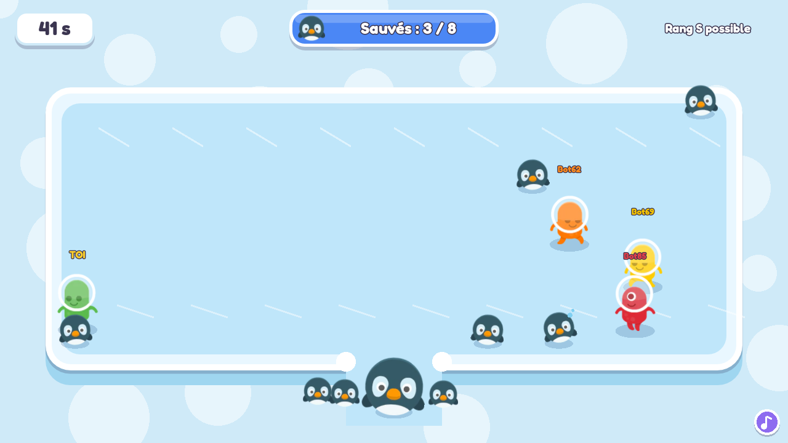

**But** : ramener tous les bébés pingouins à leur parent, derrière la fente en bas.
- Les pingouins **s'enfuient** quand on s'approche : il faut les rabattre ensemble.
- Astuce : un joueur près de la sortie, c'est plus facile.
- Rang **S** en 45 s : 10 pièces chacun · **A** en 55 s : 7 · **B** en 60 s : 4.

**Commandes** : bouger **flèches** ou **Z Q S D**.
🎮 Manette : stick.

### Cuisine en folie !
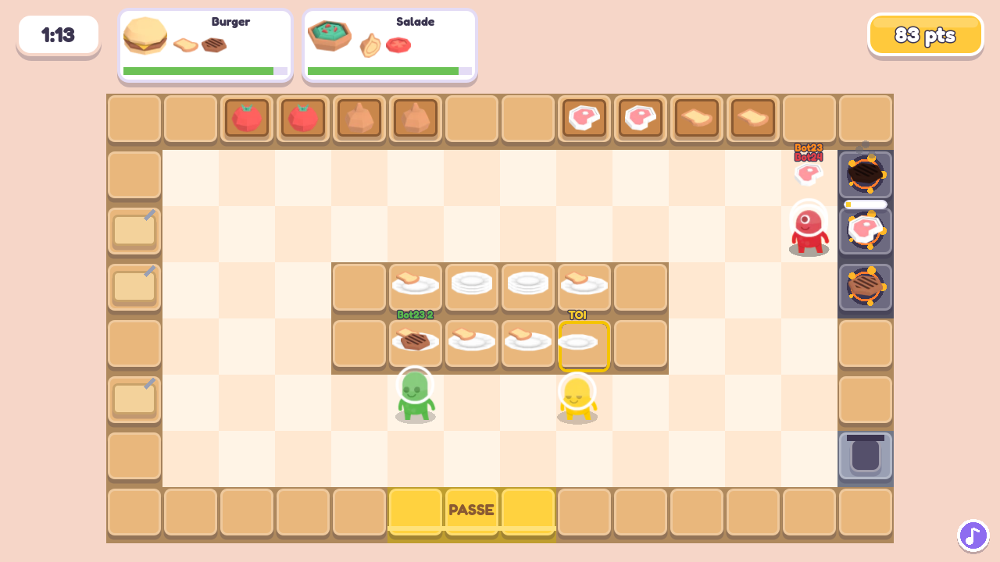

**But** : servir le plus de plats possible en 100 secondes.
- Prends les ingrédients dans les caisses, coupe tomates et oignons sur les planches.
- Cuis les steaks sur le feu (ils **brûlent** si tu les oublies !).
- Mets tout dans une assiette et sers à la passe avant la fin du ticket.
- Recettes : **burger** = pain + steak · **salade** = tomate + oignon coupés · **burger garni** = les 4.
- Rang selon le score de l'équipe : **S** (160 pts) = 10 pièces · **A** (110) = 7 · **B** (60) = 4.

**Commandes** : bouger **flèches** ou **Z Q S D** · prendre / poser **Espace** · couper **Maj / X** (plusieurs fois).
🎮 Manette : stick · **A** prendre / poser · **X** couper.

---

## 🛠️ Pour les développeurs

Les mini-jeux sont dans [`jeu/minigames/`](../jeu/minigames/), un fichier `.gd` par jeu, déclarés dans `Net.MINIGAMES` ([`jeu/net.gd`](../jeu/net.gd)).

| Clé | Fichier | Clé | Fichier |
|---|---|---|---|
| `blocks` | `blocks.gd` | `slots` | `slots.gd` |
| `paint` | `paint.gd` | `chrono` | `chrono.gd` |
| `keys` | `keys.gd` | `doodle` | `doodle.gd` |
| `parcours` | `parcours.gd` | `maze` | `maze.gd` |
| `rock` | `rock.gd` | `memory` | `memory.gd` |
| `logs` | `logs.gd` | `flags` | `flags.gd` |
| `quiz` | `quiz.gd` | `roulette` | `roulette.gd` |
| `kart` | `kart.gd` | `penguins` | `penguins.gd` |
| `triathlon` | `triathlon.gd` | `kitchen` | `kitchen.gd` |
| `rocket` | `rocket.gd` | `bumper` | `bumper.gd` |
| `mushroom` | `mushroom.gd` | `bomb` | `bomb.gd` |
| `tug` | `tug.gd` | | |

- C'est l'**hôte qui décide** (graine du tirage, fin du jeu, classement) ; chacun pilote son perso et envoie sa position.
- Les jeux de plateformes (`blocks`, `paint`, `keys`, `parcours`, `rock`, `logs`, `mushroom`, `quiz`) partagent la base [`stage.gd`](../jeu/minigames/stage.gd) ; les autres l'utilisent seulement pour l'écran d'intro.
- Aperçus des écrans d'intro : `jeu/assets/previews/<clé>.png` (1280×720).
- Tester un mini-jeu avec des robots : `PRACTICE=<clé> N=4 tools/rungame.sh` (voir `CLAUDE.md`).
